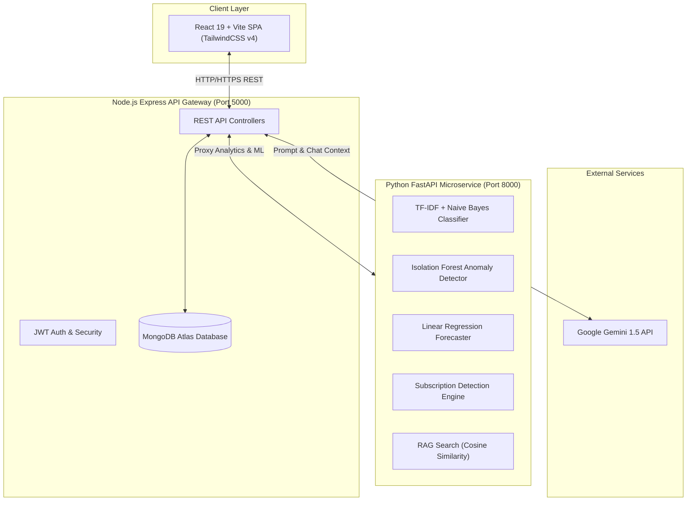

<div align="center">

  # 💎 FinNova AI

  ### Next-Generation AI-Powered Personal Finance & Wealth Intelligence Platform

  [](https://github.com/KoruKarthikRam)

  [](https://react.dev/)
  [](https://vitejs.dev/)
  [](https://tailwindcss.com/)
  [](https://nodejs.org/)
  [](https://expressjs.com/)
  [](https://www.mongodb.com/)
  [](https://www.python.org/)
  [](https://fastapi.tiangolo.com/)
  [](https://scikit-learn.org/)
  [](https://deepmind.google/technologies/gemini/)
  [](https://vercel.com/)

  <p align="center">
    <b>FinNova AI</b> is an end-to-end, intelligent financial management application that empowers users with automated transaction categorization, anomaly detection, predictive forecasting, recurring subscription tracking, RAG financial knowledge search, and an interactive AI Copilot powered by Google Gemini.
  </p>

  <p align="center">
    <a href="#-key-features">Key Features</a> •
    <a href="#-system-architecture">Architecture</a> •
    <a href="#-tech-stack">Tech Stack</a> •
    <a href="#-getting-started">Getting Started</a> •
    <a href="#-environment-variables">Environment Variables</a> •
    <a href="#-api-documentation">API Routes</a> •
    <a href="#-deployment">Deployment</a>
  </p>

</div>

---

## 🌟 Key Features

### 🤖 1. Google Gemini Financial Copilot
* **Interactive AI Advisor**: Real-time conversational AI assistance for personal budget optimization, investment strategies, and debt reduction strategies.
* **Context-Aware Insights**: Tailored recommendations generated dynamically based on active user transactions and account history.

### 🧠 2. ML Auto-Categorization Engine
* **NLP Classification**: Uses a TF-IDF vectorizer coupled with a Naive Bayes classifier trained on merchant descriptions (covering Indian & global payment patterns like Zomato, Uber, Amazon, Netflix, Swiggy, bills, rent, etc.).
* **Instant Tagging**: Predicts transaction categories automatically with confidence scoring.

### 🚨 3. Machine Learning Anomaly Detection
* **Outlier Identification**: Employs **Isolation Forest** algorithms from `scikit-learn` to analyze spending behavior and flag unusual high-value expenses or potential fraudulent transactions.

### 📈 4. Predictive Expense Forecasting
* **Linear Regression Engine**: Evaluates historical monthly expenditure trends to forecast future spending totals for the upcoming month.
* **Fallback Analytics**: Automatically balances small sample sizes with weighted average fallbacks.

### 🔄 5. Automated Subscription & Recurring Overhead Tracking
* **Recurring Billing Detection**: Scans expense patterns to auto-identify active subscriptions (Netflix, Spotify, broadband, rent, gym memberships).
* **Due Date Predictions**: Calculates upcoming payment due dates and computes total monthly recurring overhead.

### 📚 6. RAG Financial Knowledge Base
* **Retrieval-Augmented Generation**: Indexes financial literacy guides and markdown documentation.
* **TF-IDF & Cosine Similarity Search**: Delivers contextually relevant financial concepts and answers instantly.

### 📊 7. Visual Dashboards & Goal Management
* **Interactive Data Visualization**: Comprehensive charts powered by `Recharts` showing MoM trends, essential vs. non-essential spending ratios, and category breakdowns.
* **Savings Goals & Budget Targets**: Track progress toward custom savings milestones with real-time target indicators.
* **Gamified Financial Literacy**: Built-in quizzes and educational modules for user empowerment.

---

## 🏗️ System Architecture



---

## 🛠️ Tech Stack

| Domain | Technology | Description |
| :--- | :--- | :--- |
| **Frontend** | `React 19`, `Vite`, `TailwindCSS v4` | Modern, responsive SPA interface with dynamic HMR |
| **Routing & Icons** | `React Router 7`, `Lucide React` | Declarative navigation and unified icon library |
| **Data Visualization** | `Recharts` | Interactive charts, trendlines, pie charts, and analytics |
| **Backend API** | `Node.js`, `Express 5` | RESTful API gateway handling auth, CRUD, and service orchestration |
| **Database** | `MongoDB`, `Mongoose` | Scalable NoSQL document database for user profiles and transactions |
| **AI Microservice** | `Python 3.11`, `FastAPI`, `Uvicorn` | Asynchronous high-performance machine learning backend |
| **Data Science / ML** | `Pandas`, `NumPy`, `Scikit-Learn` | Data processing, TF-IDF, Isolation Forest, Linear Regression |
| **Generative AI** | `Google Gemini API` (`@google/generative-ai`) | LLM for intelligent financial copilot and smart insights |
| **Authentication** | `JSON Web Tokens (JWT)`, `Bcrypt.js` | Secure password hashing and token-based state authorization |
| **Deployment** | `Vercel`, `Render` / `Railway` | Production cloud hosting with continuous deployment |

---

## 📁 Repository Structure

```text
finnova-ai/
├── frontend/                  # React + Vite Frontend Application
│   ├── public/                # Static public assets
│   ├── src/
│   │   ├── api/               # Axios API instances and interceptors
│   │   ├── components/        # Reusable UI components (Navbar, Sidebar, Cards, Charts)
│   │   ├── layouts/           # Main layout templates
│   │   ├── pages/             # App Pages (Dashboard, Assistant, Budget, Goals, etc.)
│   │   ├── App.jsx            # Core router configuration
│   │   ├── main.jsx           # App entrypoint
│   │   └── index.css          # TailwindCSS configuration
│   ├── vercel.json            # Vercel deployment rewrite rules
│   └── package.json           # Frontend dependencies
│
├── backend/                   # Node.js + Express API Gateway
│   ├── src/
│   │   ├── config/            # DB connection setup (db.js)
│   │   ├── controllers/       # Controller logic for transactions, goals, budgets, AI
│   │   ├── middleware/        # JWT auth verification middleware
│   │   ├── models/            # Mongoose schemas (User, Transaction, Goal, Budget)
│   │   ├── routes/            # Express route handlers
│   │   └── server.js          # Express app entrypoint
│   ├── .env.example           # Environment template
│   └── package.json           # Backend dependencies
│
└── ai-service/                # Python FastAPI Machine Learning Microservice
    ├── app.py                 # FastAPI application & ML pipelines
    ├── knowledge_base/        # Financial literacy knowledge markdown docs (RAG)
    ├── test_integration.py    # Integration test suite for FastAPI endpoints
    └── requirements.txt       # Python package dependencies
```

---

## 🚀 Getting Started

### Prerequisites

Ensure you have the following installed on your local setup:
* **Node.js** (v18.0.0 or higher) & `npm`
* **Python** (v3.10 or higher) & `pip`
* **MongoDB** (Local instance or MongoDB Atlas URI)
* **Google Gemini API Key** (Obtained from [Google AI Studio](https://aistudio.google.com/))

---

### 1. Clone the Repository

```bash
git clone https://github.com/KoruKarthikRam/finnova-ai.git
cd finnova-ai
```

---

### 2. Configure Environment Variables

#### Backend Environment Setup
Create a `.env` file in the `backend/` directory:

```env
PORT=5000
MONGODB_URI=mongodb+srv://<username>:<password>@cluster.mongodb.net/finnova?retryWrites=true&w=majority
JWT_SECRET=your_super_secret_jwt_key
AI_SERVICE_URL=http://localhost:8000
GEMINI_API_KEY=your_google_gemini_api_key
```

---

### 3. Install Dependencies & Run Services

#### Step 3A: Launch Python AI Microservice

```bash
cd ai-service

# Create and activate virtual environment
python -m venv venv

# On Windows:
.\venv\Scripts\activate
# On macOS/Linux:
# source venv/bin/activate

# Install required Python dependencies
pip install -r requirements.txt

# Start the FastAPI server
uvicorn app:app --host 0.0.0.0 --port 8000 --reload
```
*FastAPI microservice will run on `http://localhost:8000` (Interactive docs available at `http://localhost:8000/docs`).*

---

#### Step 3B: Launch Node.js Backend API Gateway

Open a new terminal window:

```bash
cd backend

# Install dependencies
npm install

# Start Express server in development mode
npm run dev
```
*Backend server will run on `http://localhost:5000`.*

---

#### Step 3C: Launch React Frontend

Open another terminal window:

```bash
cd frontend

# Install dependencies
npm install

# Start Vite dev server
npm run dev
```
*Frontend app will run on `http://localhost:5173`.*

---

## 🌐 API Documentation

### Backend Gateway Endpoints (`http://localhost:5000/api`)

| Method | Endpoint | Description | Access |
| :--- | :--- | :--- | :--- |
| `POST` | `/auth/register` | Register new user account | Public |
| `POST` | `/auth/login` | Authenticate user & return JWT token | Public |
| `GET` | `/transactions` | Fetch all user transactions | Private (JWT) |
| `POST` | `/transactions` | Create transaction (Triggers ML auto-categorization) | Private (JWT) |
| `DELETE`| `/transactions/:id` | Remove transaction | Private (JWT) |
| `GET` | `/dashboard` | Fetch aggregated dashboard analytics & charts | Private (JWT) |
| `GET` | `/budgets` | Get category spending limits & current usage | Private (JWT) |
| `POST` | `/goals` | Create financial savings target | Private (JWT) |
| `POST` | `/ai/chat` | Send prompt to Gemini AI Copilot | Private (JWT) |
| `GET` | `/subscriptions` | Retrieve auto-detected recurring subscriptions | Private (JWT) |

---

### Python AI Microservice Endpoints (`http://localhost:8000`)

| Method | Endpoint | Model / Algorithm Used | Purpose |
| :--- | :--- | :--- | :--- |
| `GET` | `/health` | Health Check | Service status confirmation |
| `POST` | `/classify` | TF-IDF Vectorizer + Naive Bayes | Predict transaction category from description |
| `POST` | `/analyze` | Pandas / Aggregation Pipeline | Compute MoM trend, daily average, essential ratios |
| `POST` | `/anomalies` | Isolation Forest (`scikit-learn`) | Detect unusual high-value transaction outliers |
| `POST` | `/forecast` | Linear Regression | Forecast next month's total expenses |
| `POST` | `/subscriptions` | Heuristic Pattern Matcher | Auto-detect recurring merchant payments & due dates |
| `POST` | `/search-knowledge` | TF-IDF + Cosine Similarity | Query vectorized RAG financial knowledge base |

---

## 📦 Deployment Guide

### Deploying Frontend to Vercel

1. Connect your repository to **Vercel**.
2. Set the Root Directory to `frontend`.
3. Build Command: `npm run build`
4. Output Directory: `dist`
5. Vercel automatically reads `frontend/vercel.json` for single-page app routing.

---

### Deploying Backend & AI Microservice to Render / Railway

1. **AI Microservice**:
   - Build Command: `pip install -r requirements.txt`
   - Start Command: `uvicorn app:app --host 0.0.0.0 --port 8000`
2. **Node.js Backend**:
   - Environment Variables: Add `MONGODB_URI`, `JWT_SECRET`, `GEMINI_API_KEY`, and `AI_SERVICE_URL` (URL of deployed AI microservice).
   - Start Command: `npm start`

---

## 🤝 Contributing

Contributions, issues, and feature requests are welcome!  
Feel free to check out the [Issues Page](https://github.com/KoruKarthikRam/finnova-ai/issues).

1. Fork the Project
2. Create your Feature Branch (`git checkout -b feature/AmazingFeature`)
3. Commit your Changes (`git commit -m 'Add some AmazingFeature'`)
4. Push to the Branch (`git push origin feature/AmazingFeature`)
5. Open a Pull Request

## 👤 Author

**Koru Karthik Ram**
* GitHub: [@KoruKarthikRam](https://github.com/KoruKarthikRam)
* Repository: [finnova-ai](https://github.com/KoruKarthikRam/finnova-ai)

---

## 📄 License

Distributed under the **MIT License**. See `LICENSE` for more information.

---

<div align="center">
  <sub>Built with ❤️ by <b><a href="https://github.com/KoruKarthikRam">Koru Karthik Ram</a></b> & <b>FinNova Team</b></sub>
</div>
